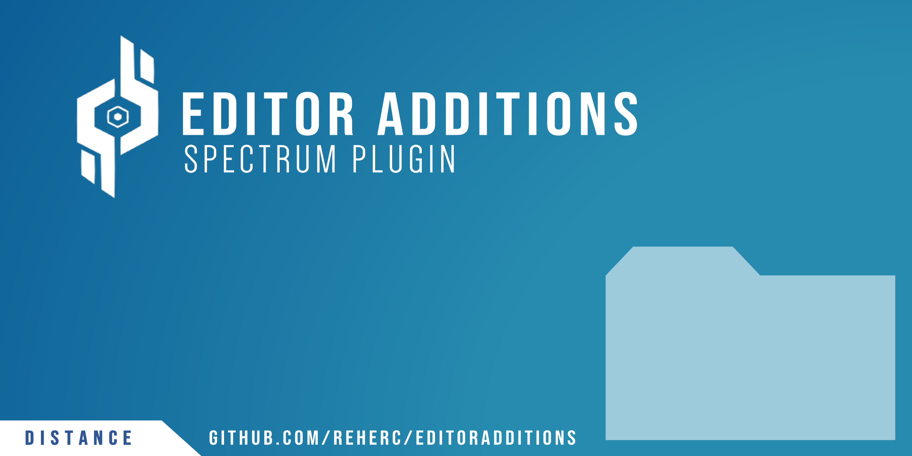

# Editor Additions
> **Enables the level editor Dev folder, adds custom object sub folders detection and allows to open workshop levels**

# Download the mod
> You can download the mod from the [Releases page](https://github.com/REHERC/EditorAdditions/releases)

# How to use the mod ?
> In the main menu go in `Options>General>Configure Spectrum Plugins>Level Editor Additions`.